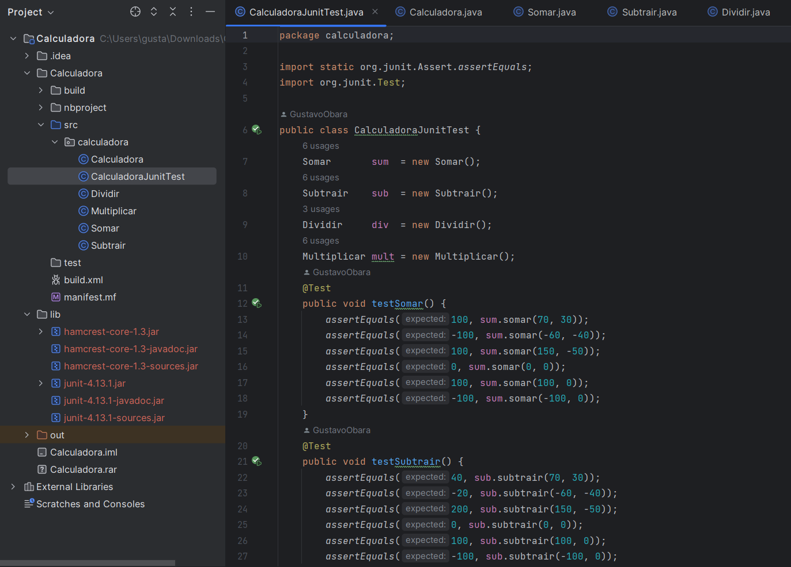

# Calculadora - Qualidade & Teste de Software / Aprendendo JUnit

## Descrição

Este projeto consiste em uma calculadora Java com classes para realizar operações matemáticas básicas (soma, subtração, multiplicação e divisão) e testes unitários usando JUnit.

## Funcionalidades

O projeto inclui quatro classes principais, cada uma responsável por uma operação matemática específica:

1. **Somar**
   - **Método:** `somar(int num1, int num2)` `return num1 + num2`
   - Descrição: Realiza a operação de adição entre dois números inteiros `num1` e `num2` e retorna o resultado.

2. **Subtrair**
   - **Método:** `subtrair(int num1, int num2)` `return num1 - num2`
   - Descrição: Realiza a operação de subtração entre dois números inteiros `num1` e `num2` e retorna o resultado.

3. **Dividir**
   - **Método:** `dividir(int num1, int num2)` `return num1 / num2`
   - Descrição: Realiza a operação de divisão entre dois números inteiros `num1` e `num2` e retorna o resultado.

4. **Multiplicar**
   - **Método:** `multiplicar(int num1, int num2)` `return num1 * num2`
   - Descrição: Realiza a operação de multiplicação entre dois números inteiros `num1` e `num2` e retorna o resultado.

## Estrutura do Projeto

A estrutura do projeto está organizada da seguinte forma:

- `src/calculadora`
  - `Somar.java`: Classe para a operação de soma.
  - `Subtrair.java`: Classe para a operação de subtração.
  - `Dividir.java`: Classe para a operação de divisão.
  - `Multiplicar.java`: Classe para a operação de multiplicação.
  - `Calculadora.java`: Classe de teste sem o framework JUnit, para testar todas as operações matemáticas.
  - `CalculadoraJunitTest.java`: Classe de teste JUnit para testar todas as operações matemáticas.

## Testes Não Automatizados

Os testes não automatizados foram realizados na classe `Calculadora.java`. Eles consistem em chamadas manuais dos métodos das operações matemáticas com diversos cenários, incluindo números positivos, negativos, nulos e a divisão por zero. Os resultados dos testes foram impressos no console para avaliação.

## 
## Testes Automatizados (JUnit)

Os testes automatizados foram realizados na classe `CalculadoraJunitTest.java` usando o framework JUnit. Esses testes foram criados de forma a verificar se as operações matemáticas estão funcionando corretamente. Foram definidos diversos cenários de teste com valores diferentes e seus resultados esperados. O framework JUnit executou esses testes de forma automática e comparou os resultados obtidos com os resultados esperados.

## 

## Última atualização - 16/11/2023
